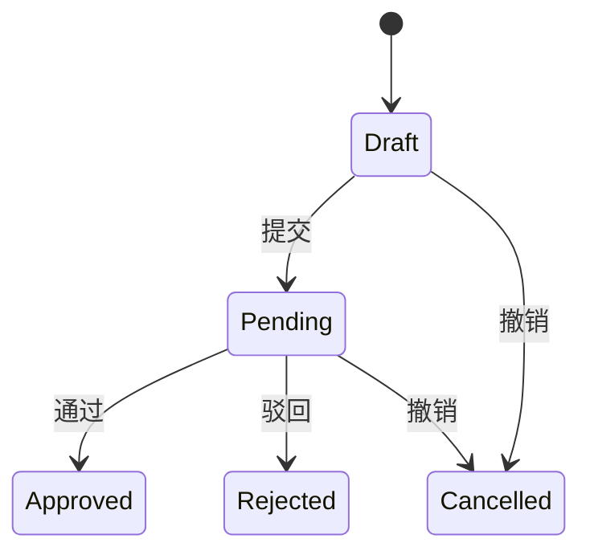
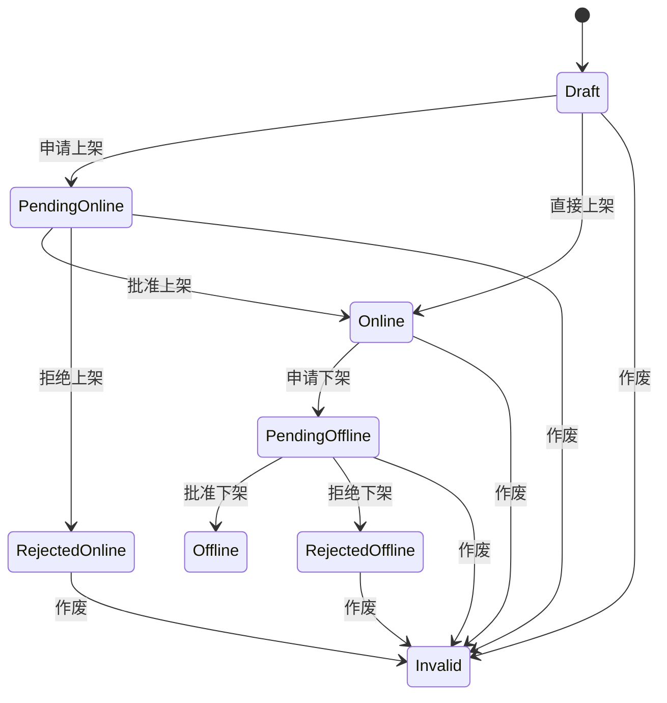
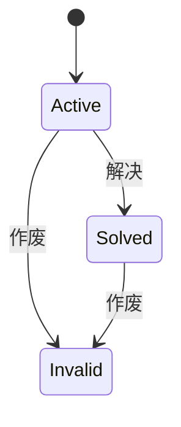
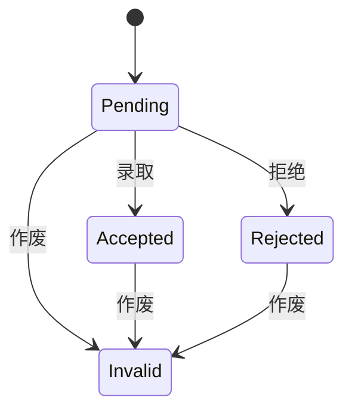

# 贝壳青创汇设计文档

## 身份系统

平台用户拥有一个主身份。除创业团队外，学生、导师、投资人、合作人、管理员均属于主身份。

创业团队是附加身份。学生提交认证材料并通过审批后，获得创业团队附加身份，但主身份仍然保持为学生。

### 学生 / Student

所有注册（非游客）用户的默认初始主身份。

### 创业团队 / Team

学生提交认证材料，通过审批后获得的附加身份。

### 导师 / Mentor

面向企业家、创业导师、校友导师、行业专家顾问等。由管理员手动添加。

### 投资人 / Investor

面向校外投资机构、天使投资人、产业投资人。由管理员手动添加。

### 合作人 / Partner

面向企业园区、孵化器、服务机构、媒体、供应链、资源方平台等。由管理员手动添加。

### 管理员 / Admin

管理和维护平台的人员。

## 对象系统

### 创业申请 / Startup Application

一个创业申请由一个学生创建，一个学生可以有多个创业申请。

权限：

- 增：学生；
- 查：创建者或管理员；
- 通过、驳回：管理员；
- 撤销：创建者或管理员；

### 项目 / Project

一个创业项目由一个创业团队创建，一个创业团队可以有多个项目。

权限：

- 增：创业团队；
- 查：所有者、其他非游客用户或游客（仅查看公开摘要与上架内容）。
- 申请上架、申请下架：所有者；
- 批准上架、批准下架、拒绝上架、拒绝下架、直接上架、直接下架：管理员；
- 作废：所有者或管理员。

### 招募 / Recruitment

一个招募请求由一个创业团队创建，一个创业团队可以有多个招募请求。

权限：

- 增：创业团队；
- 查：所有者、其他非游客用户或游客（仅查看公开摘要与非解决非作废内容）。
- 解决：发起者或管理员；
- 作废：发起者或管理员。

### 招募响应 / Recruitment Response

一个招募响应由一个用户创建，一个用户可以有多个招募响应。

权限：

- 增：非游客用户；
- 查：原招募发起者或管理员。
- 录取、拒绝：原招募发起者；
- 作废：受募者或管理员。

## 网站功能

### 首页

包括标题、主文案、副文案、数据大屏展示区域、精选项目区域、身份入口区域（登录、成为 XX）。

### 项目烩

项目列表页对游客与已登录用户都可见。游客仅能查看公开摘要，登录后可查看完整内容，并可筛选和搜索，通过网格卡片形式展示已有项目；可以进入项目的详情页面。

### 创业团队

创业团队列表页对游客与已登录用户都可见。游客仅能查看公开摘要，登录后可查看完整内容，并可筛选和搜索，通过网格卡片形式展示已有创业团队；可以进入创业团队的详情页面。

### 其他功能

后续再渐进式开发。
